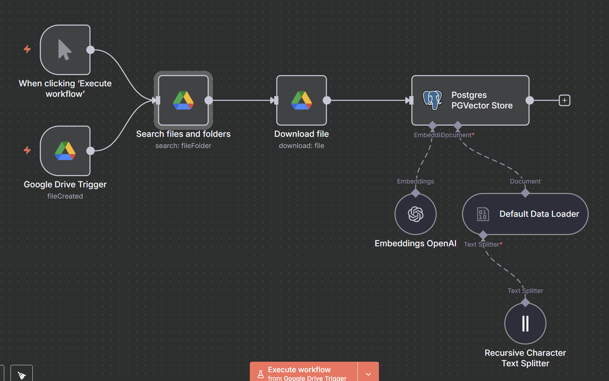
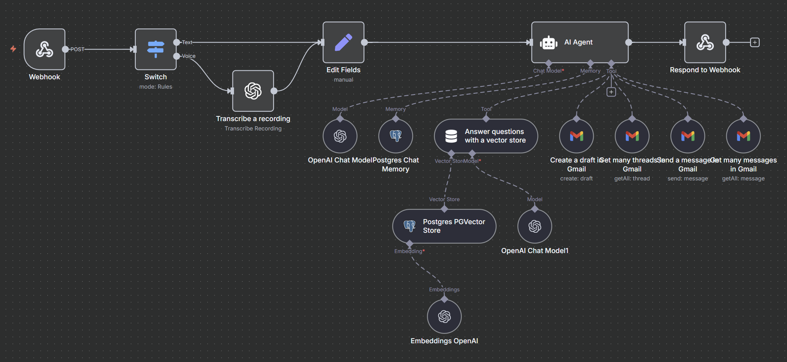

# Intelligent RAG Chatbot with Gmail & Drive Integration

This project is an AI-powered personal assistant designed to streamline the workflows of knowledge workers and researchers. It tackles the issue of fragmented information by unifying search, communication, and information management across various platforms.

The chatbot allows users to interact through text or voice, asking questions and receiving context-aware answers. It can directly ingest and index files from Google Drive, transforming scattered documents into a searchable and intelligent knowledge base. This is achieved through Retrieval Augmented Generation (RAG), which provides precise answers and minimizes inaccuracies.

A key feature of this tool is its integration with Gmail, enabling users to draft and send emails with AI assistance. It can also retrieve existing email threads and unread messages, ensuring seamless context switching and reducing the time spent on repetitive communication tasks.

The entire system is orchestrated using n8n, which connects AI models from OpenAI, a PGVector store for scalable data management, and Google integrations. This creates a secure, private, and personalized assistant that adapts to each user's data.

## Key Features

*   **Conversational Interface:** Interact with the chatbot via text or voice.
*   **Google Drive Integration:** Ingest and search for information across your personal and organizational files.
*   **Intelligent Search:** Utilizes RAG to provide accurate, context-aware answers from your documents.
*   **Email Automation:** Draft and send emails directly through a connection with your Gmail account.
*   **Unified Workflow:** Reduces the need to switch between different applications, boosting productivity.

## n8n Workflows

This project is powered by two core n8n workflows:

### 1. Ingestion Flow ([`ingest.json`](./ingest.json))

This workflow is responsible for ingesting documents from Google Drive, processing them, and storing them in the PGVector database for retrieval.

### 2. RAG Chatbot Flow ([`rag_chatbot.json`](./rag_chatbot.json))

This workflow handles user interaction, retrieves relevant information from the vector store, and generates responses using the RAG model. It also integrates with Gmail for email functionalities.

